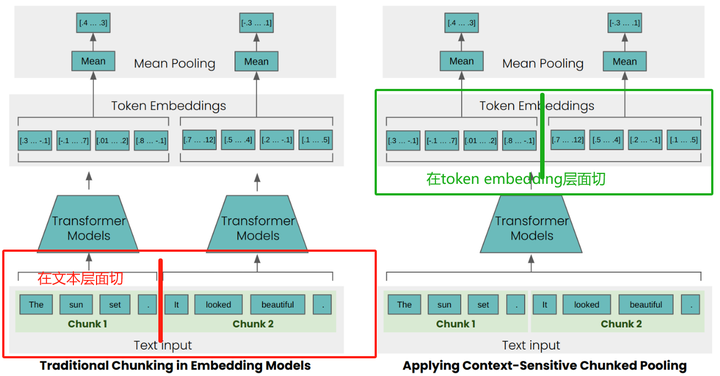

# Late Chunking Chinese
Late Chunking是最近Jina AI提出的一种技术 [**官方仓库**](https://github.com/jina-ai/late-chunking/tree/main) | [**论文**](https://arxiv.org/abs/2409.04701) 。常规的RAG文本切块如左下图所示，先进行文本切分，分别过Transformer处理，通过meaning pooling得到每个chunk的句向量。假设有如下这段话：“战士金是个程序员。他最近合著出版了《大模型RAG实战》一书。”如果按照句号切分这段话，并分别过transformer处理，模型是并不能感知到第二个chunk里边的“他”是指的谁的。但如果先将这一整段话经过transformer处理，生成token embeddings，再在句号位置处切分，Transformer的self attention机制是能够学习到第二个chunk的“他”指的是第一个chunk里边的“战士金”。这种先将文本变成embedding，再进行切分的策略就是Late Chunking。

本仓库基于Late Chunking官方仓库进行了一些非常小的改造，使其支持中文。更详细的介绍见我的中文博客：

